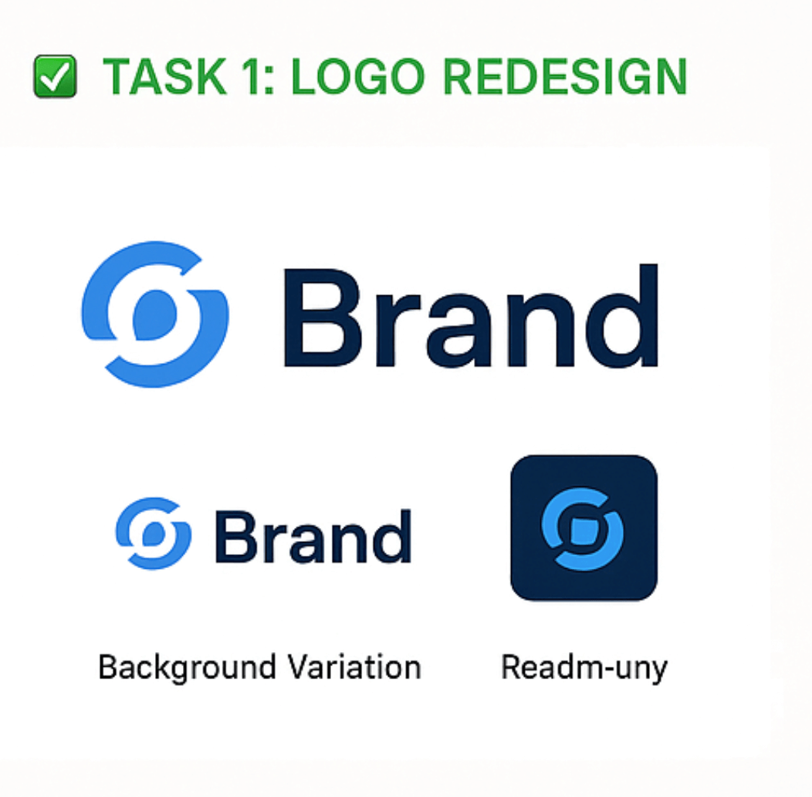
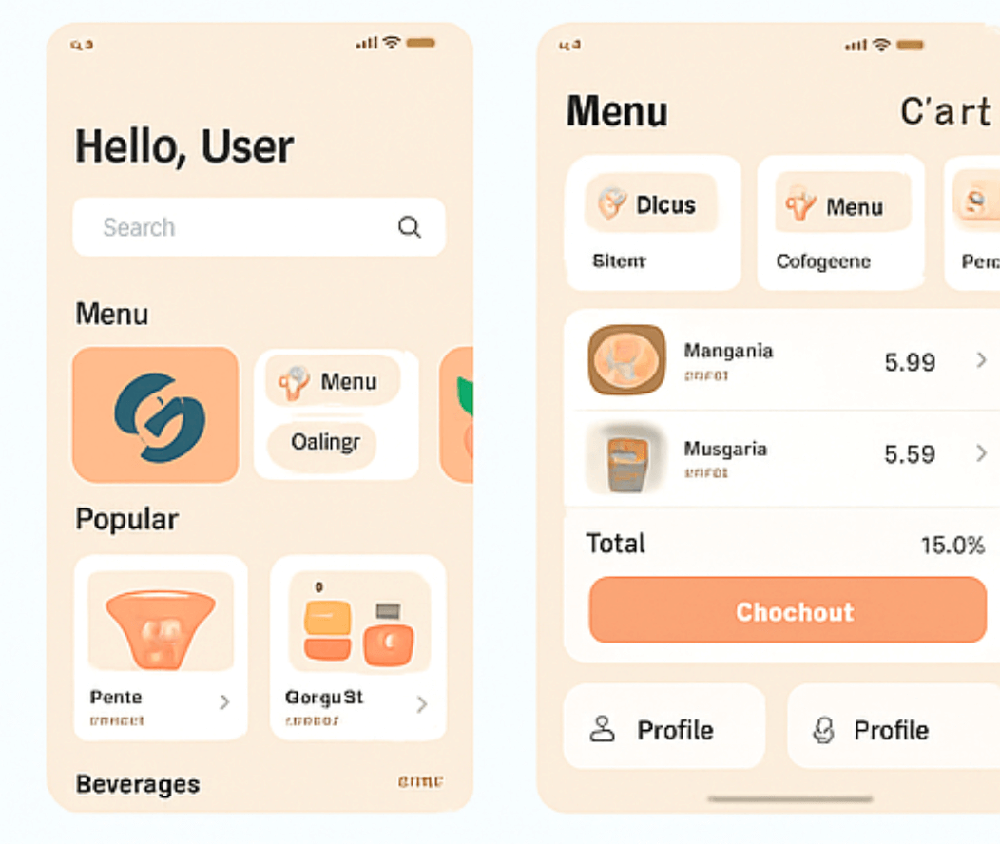
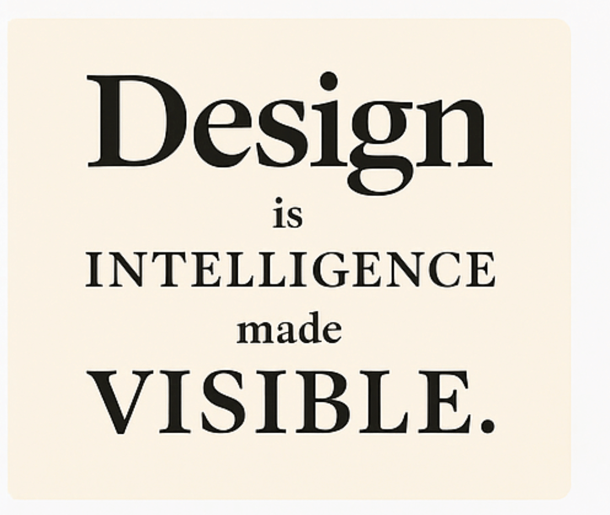
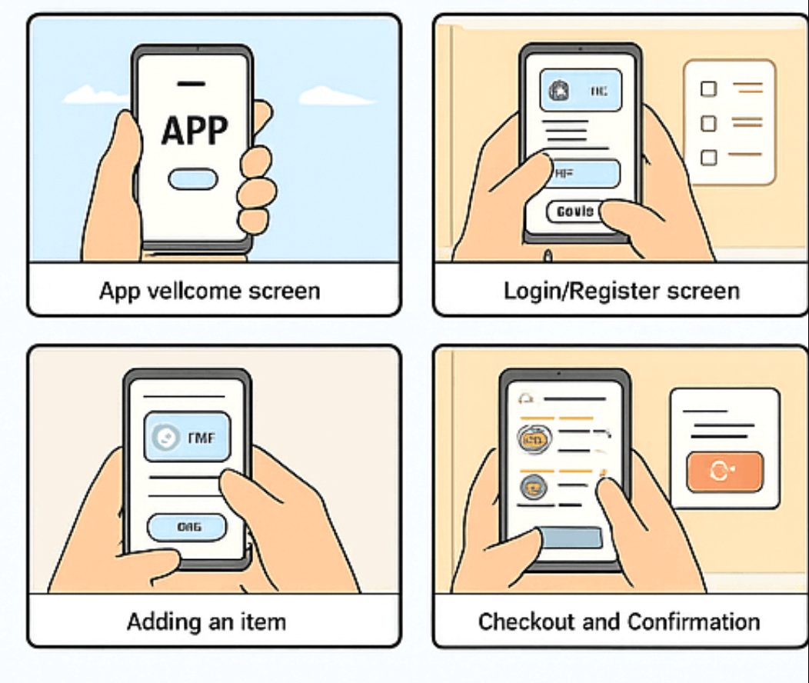

# CodeAlpha Graphic Designing Internship

This repository contains all 4 task submissions for the CodeAlpha Graphic Design Internship.

---

## ✅ Task 1: Logo Redesign

## ✅ Task 2: UI/UX Design

## ✅ Task 3: Typography Practice

## ✅ Task 4: Storyboarding

---

### 🛠 Tools Used:
- Canva
- Figma
- Illustrator
- Storyboard That

✅ Completed all 4 tasks and submitted successfully.
